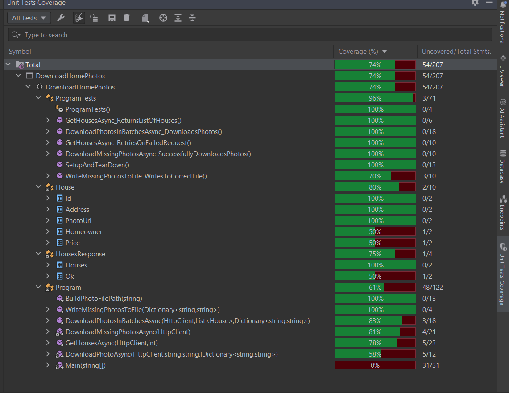

    Clone or download the repository to your local machine.
    Install dotnet - you can find linux and macos installers and binaries here - https://dotnet.microsoft.com/en-us/download/dotnet/8.0

    Navigate to the project directory in your terminal or command prompt.
    Run the following command to run the project:

bash

dotnet run

This will execute the Main method of the program, which will retrieve house data from the API, download photos, etc.

    If you encounter issues try building the project first by running the following command:

bash

dotnet build

    

The project includes unit tests written with NUnit.

    You can run unit tests using the following command:

bash

dotnet test

Current Coverage is 74% as reported by Jetbrains Rider IDE and a screenshot is included herein 